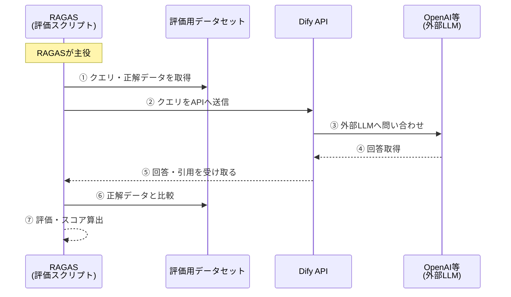

# 経緯
Dify には既に精度評価ツール（Langfuse / LangSmith / Opik / W&B Weave）との連携機能があり、正直これらのツールを使うのが一番手っ取り早い。

が、実際問題ビジネスの場で簡単に「この新しい SaaS サービス使いまーす」とはならないかと思うので、ここでは RAGAS を使った精度評価方法を紹介する。

ちなみに Self-hosted 前提であれば、Langfuse / Opik がよい。SaaS でも良いのであれば運用コストを減らすために LangSmith / W&B Weave を選ぶのもアリ。

# 結論
RAGAS から Dify API に対してリクエストを送信し、評価用データセットとレスポンスを比較することで精度を評価する。



スクリプト全文は下記を参照。

# 評価手順
評価用データセットには [allganize/RAG-Evaluation-Dataset-JA](https://huggingface.co/datasets/allganize/RAG-Evaluation-Dataset-JA) を使う


## 事前準備
プロジェクトを作成
```bash
$ pip install uv
$ uv init eval-dify
$ cd eval-dify
```

仮想環境を作成して有効化
```bash
$ uv sync
$ source .venv/bin/activate
```

依存パッケージをインストール
```bash
$ uv add datasets requests pandas tqdm ragas langchain-openai python-dotenv time
```

## Dify に評価用ワークフローを作成

今回は至って簡単な Naive RAG を対象とする。

事前にナレッジベースにはドメインに応じたナレッジを登録してあり、知識検索ブロックでそれぞれのナレッジを参照するようにした。検索方法はハイブリッド検索で、"text-embedding-3-small" による埋め込みを実施。


## スクリプトの実装
プロジェクト内部の `main.py` を編集して、以下のスクリプトを記述する

```python
import os
import time
from datasets import load_dataset
import requests
import pandas as pd
from tqdm import tqdm
from dotenv import load_dotenv
from ragas.metrics import faithfulness, answer_relevancy, context_precision
from ragas.evaluation import evaluate
from langchain_openai.chat_models import ChatOpenAI
from ragas import EvaluationDataset

load_dotenv()
API_URL = os.getenv("DIFY_BASE_URL", "http://localhost/v1/chat-messages")
API_KEY = os.getenv("DIFY_API_KEY")
PROGRESS_CSV = "predictions_progress.csv"
FINAL_CSV = "predictions_final.csv"


def get_dify_answer_and_context(query, max_retries=5):
    headers = {
        "Authorization": f"Bearer {API_KEY}",
        "Content-Type": "application/json"
    }
    data = {
        "inputs": {},
        "query": query,
        "response_mode": "blocking",
        "conversation_id": "",
        "user": "ragas-eval",
        "files": []
    }
    for attempt in range(max_retries):
        try:
            resp = requests.post(API_URL, headers=headers, json=data, timeout=30)
            # Difyが400などのerror statusを返した場合
            if resp.status_code == 400:
                print(f"[{attempt+1}/{max_retries}] 400 Error (likely rate limit) - Backing off...")
                time.sleep(5 * (attempt + 1))  # 5, 10, 15, ...秒と指数バックオフ
                continue
            resp.raise_for_status()
            resp_json = resp.json()
            answer = resp_json.get("answer", "")
            resources = resp_json.get("metadata", {}).get("retriever_resources", [])
            contexts = [r.get("content", "") for r in resources]
            doc_names = [r.get("document_name", "") for r in resources]
            return answer, contexts, doc_names
        except Exception as e:
            print(f"[{attempt+1}/{max_retries}] Error fetching answer for query : {e}")
            time.sleep(5 * (attempt + 1))
    # すべてのリトライ失敗時
    return "Error: Rate limit (all retries failed)", [], []


def save_progress(predictions, filename):
    pd.DataFrame(predictions).to_csv(filename, index=False)


def run_evaluation():
    # データセット読み込み（全件）
    dataset = load_dataset("allganize/RAG-Evaluation-Dataset-JA", split="test")
    predictions = []
    for i, row in enumerate(tqdm(dataset, desc="Evaluating")):
        q = row["question"]
        gt = row["target_answer"]
        gt_file = row["target_file_name"]
        ans, contexts, doc_names = get_dify_answer_and_context(q)
        predictions.append({
            "question": q,
            "ground_truth": gt,
            "prediction": ans,
            "contexts": contexts,
            "reference_doc_name": gt_file,
            "retrieved_doc_names": doc_names,
        })
        print(f"[{i+1}/{len(dataset)}] Q: {q[:30]}... | Ans: {ans[:30]}... | Ctx: {len(contexts)} docs")
        if (i+1) % 10 == 0:
            save_progress(predictions, PROGRESS_CSV)
    save_progress(predictions, FINAL_CSV)
    return pd.DataFrame(predictions)


def prepare_ragas_dataframe(df):
    # ragas用DataFrame作成
    return pd.DataFrame({
        "user_input": df["question"],
        "response": df["prediction"],
        "ground_truth": df["ground_truth"],
        "retrieved_contexts": df["contexts"],
    })


def main():
    df = run_evaluation()
    df_ragas = prepare_ragas_dataframe(df)
    ragas_dataset = EvaluationDataset.from_pandas(df_ragas)
    llm = ChatOpenAI(model="gpt-4o-mini")
    results = evaluate(
        ragas_dataset,
        llm=llm,
        metrics=[faithfulness, answer_relevancy],
    )
    print("===== Ragas Evaluation Results =====")
    print(results)


if __name__ == "__main__":
    main()
```

OpenAI API を評価 LLM に使用しているが、他のモデルをインポートして入れ替えることもできる。

例えば Azure OpenAI は `from langchain_openai.chat_models import AzureChatOpenAI` が使える。他モデルのインポート情報は [Chat models | 🦜️🔗 LangChain](https://python.langchain.com/docs/integrations/chat/) を参照

### 補足：精度評価の軸
今回は Faithfulness, Answer Relevancy, Context Precision の 3 軸で評価している

- Faithfulness
    - 回答文（answer）が引用文（retrieved contexts）と一貫しているかを測る
- Answer Relevancy（Response Relevancy）
    - 質問文（question）に対する回答文（answer）の関連性を測り、不十分・冗長・不要な情報があれば減点する

以下のメトリクスも取得できると便利。今回は評価用データセットに正解となるコンテキストの内容までは入っていなかったので省略

- Context Precision (LLMContextPrecisionWithReference)
    - 正解の引用（reference）がどれだけ上位で Retrieve できているかを測る
- Context Recall
    - 正解の引用（reference）に含まれる主張（claim）が引用文（retrieved contexts）でどれだけ裏付けできるかを測る


## 環境変数の設定
`main.py` と同階層に `.env` ファイルを作成する

```bash
$ vim .env
```

```bash:.env
DIFY_BASE_URL=<Dify の chat-messages エンドポイント URL>
DIFY_API_KEY=<対象の Dify アプリの API キー>
OPENAI_API_KEY=<OpenAI API の API キー>
```

`DIFY_BASE_URL` は `http://<ドメイン名>/v1/chat-messages` という構造になる。スキップで `localhost` を参照する

`DIFY_API_KEY` は対象 Dify アプリを開き、画面左端メニューの「API アクセス」を選択する


画面右上の「API キー」を押下して表示されるモーダルからキー発行できる


## スクリプトの実行
スクリプトを実行して評価する

```bash
$ uv run main.py
```

精度評価中は以下のような進捗状況が表示される
```bash
$ uv run main.py
Evaluating:   0%|                                                                               | 0/300 [00:00<?, ?it/s][1/300] Q: 火災保険の収益悪化に対し、損害保険各社はどのような収益改善策... | Ans: 文脈に基づくと、損害保険各社は火災保険の収益改善のために以下... | Ctx: 4 docs
Evaluating:   0%|▏                                                                      | 1/300 [00:07<38:01,  7.63s/it][2/300] Q: 2017年度から2021年度までのどの年が最も自然災害の保険... | Ans: 2017年度から2021年度までの中で、最も自然災害の保険金... | Ctx: 4 docs
Evaluating:   1%|▍                                                                      | 2/300 [00:11<26:57,  5.43s/it][3/300] Q: 主要生保のソルベンシー・マージン比率の推移を考慮すると、令和... | Ans: 「文脈」には主要生保のソルベンシー・マージン比率の推移や具体... | Ctx: 4 docs
Evaluating:   1%|▋                                                                      | 3/300 [00:14<21:46,  4.40s/it][4/300] Q: 生命保険協会や金融庁は保険代理店の業務品質評価運営に対してど... | Ans: 生命保険協会や金融庁は、保険代理店の業務品質評価運営に対して... | Ctx: 4 docs
Evaluating:   1%|▉                                                                      | 4/300 [00:22<28:34,  5.79s/it][5/300] Q: 外貨建保険の販売による苦情件数および苦情発生率の変動傾向につ... | Ans: 外貨建保険の販売による苦情件数は、近年減少傾向にあったものの... | Ctx: 4 docs
Evaluating:   2%|█▏                                                                     | 5/300 [00:28<28:41,  5.84s/it][6/300] Q: 令和6年の景気動向に関する見通しについて、大企業非製造業の前... | Ans: 令和6年の景気動向に関する大企業非製造業の前回調査、現状判断... | Ctx: 4 docs
Evaluating:   2%|█▍                                                                     | 6/300 [00:32<26:00,  5.31s/it][7/300] Q: 法人企業景気予測調査（令和６年４～６月期調査）の景況判断BS... | Ans: 化学工業は前回調査から9.6ポイント上昇しました。... | Ctx: 4 docs
Evaluating:   2%|█▋                                                                     | 7/300 [00:34<19:32,  4.00s/it][8/300] Q: 令和6年4~6月期の国内の景況判断BSIにおいて、中堅企業と... | Ans: 文脈には、令和6年4-6月期の国内の景況判断BSIにおける中... | Ctx: 4 docs
Evaluating:   3%|█▉                                                                     | 8/300 [00:36<16:28,  3.39s/it]
```

## 精度測定結果
参考までに、結果は以下の通り
```
===== Ragas Evaluation Results =====
{'faithfulness': 0.7735, 'answer_relevancy': 0.1084}
```

Answer Relevancy 低すぎない？
Faithfulness は高いので、Retrieve の仕方を工夫する必要があるのかも

