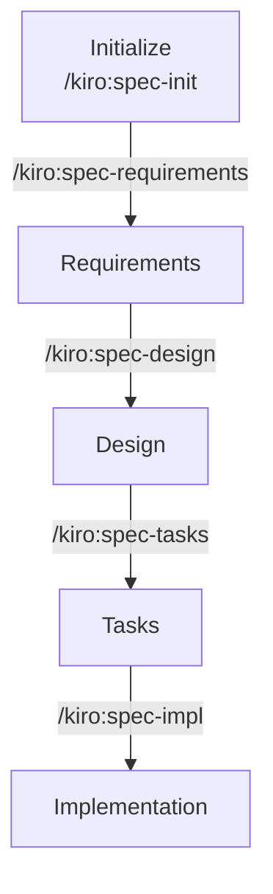

本記事では Kiro IDE を使った仕様駆動開発を実践したことがあるユーザに対し、開発環境を cc-sdd x Claude Code に円滑に移行するための開発手順を説明します。

# 前提条件
- cc-sdd は Claude Code の Slash Commands 版で進めます。 
- Kiro IDE を使った仕様駆動開発を実践したことがある読者を想定しています。
  - そうでない方は [Concepts - IDE - Docs -Kiro](https://kiro.dev/docs/specs/concepts/) を読むことを推奨します。

# 導入手順
Claude Code と cc-sdd の導入手順は以下で説明しています。（AWS Bedrock 前提）
https://qiita.com/Stellarium/items/bd176f7c88203ceea9d0

# 主な流れ
前提として、cc-sdd は Kiro 式の「Requirements → Design → Tasks」という流れをベースとした仕様駆動開発ツールです。

細かい差分（最初に `/kiro:spec-init` が必要）はありますが、基本的には Kiro IDE を使って Spec モードで進めるように仕様駆動開発を進めることができます。



# 開発手順
それぞれのフェーズが完了したら人間がレビューします。レビューが完了したらその旨を伝えることで次のフェーズに移行できます。

## 事前準備
`.kiro/steering/` フォルダ内にステアリング情報（実態は Markdown ファイル）を格納し、プロジェクトのベースラインを設定します。

`/kiro:steering` コマンドを実行することで基本的なステアリング情報を自動的に作成することが可能で、既存プロジェクトの場合はコードベースから自動解析してステアリング情報を作成します。

また、`/kiro:steering-custom` コマンドを実行することで、ユーザ独自のカスタムステアリング情報を作成することもできます。

:::message alert
本家の Kiro とは異なり、**ファイルパス単位でステアリング情報を出し分ける機能はありません**。

Claude Code 自体の Rules を用いるか、`.claude/commands/kiro` から cc-sdd をカスタマイズする必要があります。
:::

### Step0. `/kiro:spec-init <description>`
まずは `spec-init` コマンドで &lt;description&gt; 機能を実現するためのスペックを初期化します。

これにより `.kiro/specs/<feature-name>` フォルダが作成され、後続の Requirements フェーズが開始できる状態になります。

:::message
`<description>` は実現したい機能を表す説明文が入ります。

cc-sdd は `<description>` をもとに `requirements.md` を作成するため、この説明文を具体的にすることで精度の高い要件定義を生成することができます。
:::

### Step1. `/kiro:spec-requirements <feature-name>`
`spec-requirements` コマンドで &lt;feature-name&gt; の要件定義を開始します。

これにより `.kiro/specs/<feature-name>/requirements.md` が作成され、機能に対する要件が定義されます。

あくまでコマンド実行時に生成される `requirements.md` はドラフト版であり、ユーザが中身を確認して内容の妥当性を確認する必要があります。VSCode なりでファイルの中身を閲覧し、要件に過不足がないか、要件の解釈が誤っていないかを確認します。

誤った要件があった場合は Claude Code 内で自然言語で指摘することで修正します。

:::message alert
直接 `requirements.md` を修正することも可能ですが、他機能との整合性やメタデータの更新などのプロセスがあるため、自然言語で Claude Code に修正を指示することを推奨します。
:::

:::message
既存コードベースがある場合は `/kiro:validate-gap` で `requirements.md` とコードベースとの整合性を検証することができます。
:::


### Step2. `/kiro:spec-design <feature-name>`
要件定義が完了したら、`spec-design` コマンドで &lt;feature-name&gt; の設計を開始します。

これにより `.kiro/specs/<feature-name>/design.md` が作成され、機能に対する設計が定義されます。

これも Requirements フェーズと同様に初回に生成される `design.md` はドラフト版であるため、ユーザが中身を確認して内容の妥当性を検証する必要があります。

こちらも、誤った内容がある場合は自然言語で Claude Code に指摘することで修正します。

:::message alert
`spec-design` では明示的に変更を要件定義に伝搬させることは記述されていない。もし伝搬されないといったことが多発するようであれば、cc-sdd のカスタマイズを推奨します。
:::

:::message
設計に対する機械的なレビューを `/kiro:validate-design <feature-name>` コマンドで実行することができます。（内部的には `.kiro/settings/rules/design-review.md` に則ったレビュー）
:::

### Step3. `/kiro:spec-tasks <feature-name>`
設計が完了したら、`spec-tasks` コマンドで &lt;feature-name&gt; の作業タスク落とし込みを開始します。

これにより `.kiro/specs/<feature-name>/tasks.md` が作成され、作業タスクが一覧化されます。

Tasks においても同様に初回に生成される `tasks.md` はドラフト版であるため、ユーザが中身を確認して内容の妥当性を確認します。

これまでの `requirements.md` と `design.md` を踏まえて、必須でないタスクには `- [ ]*` という記載をします。また、並行に進められるタスクには `(P)` と記載されます（Kiro には無い機能のはず）。

### Step4. `/kiro:spec-impl <feature-name> <task-numbers>`
一連の作業が完了したら `spec-impl` コマンドで実装に入ります。

これにより指定した `<task-numbers>` に対して `requirements.md` および `design.md` に基いた実装が開始されます。実装はテスト駆動開発を前提にしており、RED → GREEN → REFACTOR → VERIFY という順で各タスクが実装されます。

:::message
実装に対する機械的なレビューを `/kiro:validate-impl <feature-name> <task-numbers>` コマンドで実行することができます。
:::

# 補足：cc-sdd の仕組み
cc-sdd をプロジェクトに導入すると、以下の Slash Commands とファイルが配置されます。

```
Project
├─.claude
│  └─commands
│      └─kiro
└─.kiro
    ├─settings
    │  ├─rules
    │  └─templates
    │      ├─specs
    │      ├─steering
    │      └─steering-custom
    ├specs
    │   └─<feature-name>
    └─steering
```

先に紹介した `/kiro:xxx` 系のコマンドは `.claude/commands/kiro` 内部に配置されており、コマンド実行時に kiro フォルダ配下の Markdown ファイルが読み出されて Claude Code に指示されます。

また、それぞれの `/kiro:xxx` 系コマンドは別の定義ファイルを読み込むこともあり、ルール系のファイルは `.kiro/settings/rules` に、テンプレート系のファイルは `.kiro/settings/templates` 配下に格納されています。

cc-sdd を仕様駆動開発たらしめる機能はこれらの Markdown ファイル（と JSON ファイル）によって実現されており、これらの Markdown ファイルを直接編集することでカスタマイズも可能です。

# 補足：Claude Code の標準機能との棲み分け
cc-sdd をプロジェクトに導入することで、`/kiro:xxx` 系の新たなコマンドと、ステアリング情報を格納する `.kiro/steering` フォルダが追加されます。

`/kiro:xxx` はユーザが明示的に Claude Code に指示することでトリガーされ、`.kiro/steering` フォルダ配下のファイルは cc-sdd の開発エコシステムの中で用いられます。

Claude Code は他にも Skills や Hooks などの機能がありますが、これらは cc-sdd 導入後も機能として利用できます。従って、既存の Claude Code 基本機能はそのまま流用したうえで cc-sdd を使った仕様駆動開発を進めることができます。

ファイルパスベースのルール読み込みや、MCP ツールなど機能は既存の Claude Code に則って導入および利用を続けてください。

# 参考文献

https://qiita.com/tomada/items/6a04114fc41d0b86ffee

https://github.com/gotalab/cc-sdd/blob/main/docs/guides/ja/command-reference.md

https://code.claude.com/docs/ja/overview
