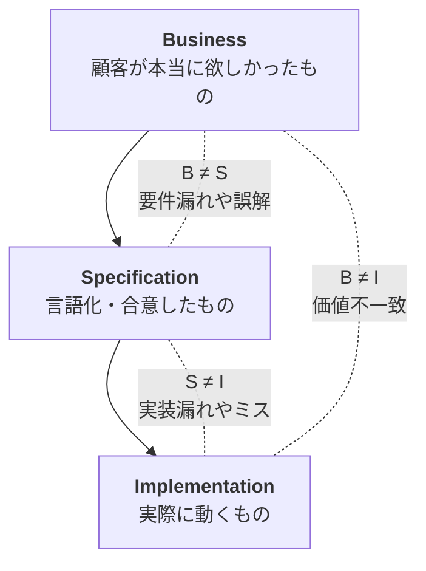

AI駆動開発の文脈では、仕様駆動開発と Vibe Coding が二項対立のように語られることがよくあります。

しかし、実際にはどちらが優れているというより、状況に応じて両者を使い分けること自体が重要だと考えています。

# 仕様駆動開発と Vibe Coding 
そもそも仕様駆動開発と Vibe Coding は何者なのか。

仕様駆動開発は従来の開発のように要件定義書や詳細設計などの仕様をスペックとして明文化することで、後工程における AI の揺らぎを最小化させる手法のことです。有名どころだと、Kiro や spec-kit、cc-sdd あたりが有名なのではないでしょうか。

一方で Vibe Coding は明文化されたスペックよりも、人間の Vibe（雰囲気、感覚）で実装を進める手法です。こちらのほうが AI と併走して進めていくイメージが強いと思います。

# AI 駆動開発におけるソフトウェアの不具合とは？
AI 駆動開発ではデリバリ速度が向上すると言われていますが、一方で AI の作ったコードの品質が心配といった声もよく聞きます。

ただし、ここでいきなり AI 駆動開発における品質問題を議論するよりも、果たして「品質」とは何なのか？「不具合」とは何なのか？を明確にする必要があります。

## 不具合は3つのズレに分解できる

そもそも品質とは以下のように定義できます。（ISTQB）

> The degree to which a work product satisfies stated and implied requirements.
> https://glossary.istqb.org/en_US/term/quality?term=quality&exact_matches_first=true

つまり、品質とは明文化された（stated）要求と明文化できていない（implied）要求の２つによって成立しています。不具合とは、この因数分解された品質と実装のズレによって生じます。

実務的には、次の 3 層として見ると整理しやすいです。

1. 期待（**B**usiness）: 顧客が本当に欲しかったもの
2. 仕様（**S**pecification）: 実装に向けて言語化・合意したもの
3. 実装（**I**mplementation）: 実際にシステムとして動くもの

AI は Specification → Implementation の落とし込みは忠実に行いますが、そもそも Business が曖昧な場合や Business → Specification の落とし込みが不十分な場合は B ≠ I となってしまうため、「思っていたものと違う」という顧客の不満に繋がります。

これは Frederick P. Brooks, Jr. が提唱するところの

- 本質的複雑性（Essential complexity）
- 偶有性複雑性（Accidental complexity）

の関係性に似ています。

Specification を明確化することで Implementation は質の高いものが出来上がりますが、本質的複雑性である Business が明確でないと、それに起因する Specification を如何に作り込んだところで Implementation は質の低いものが出来上がります。

# Vibe Coding が活きる瞬間

Business が曖昧なとき、Specification を如何に作り込んだところで最終的な成果物は質が低くなってしまうことは先述したとおりです。

つまり、こういった状況でスペックを作り込んだとしても AI が忠実に実装するシステムは顧客の抱えているイメージとは異なるものになってしまいます。

そこで有効なのが探索的に実装を進めるアプローチ、Vibe Coding です。

1. まず Vibe Coding で高速に作る
2. 顧客に触ってもらう
3. 認識が変わる
4. 軌道修正する
5. （繰り返し）

アジャイル開発においても、高速にイテレーションを回すことで顧客のニーズにアジャストしていく考えがありますが、Vibe Coding はこの探索を高速に回し、顧客と実装のズレを素早く無くすための手段として機能します。

# 仕様駆動が活きる瞬間

一方で、解決したい課題（Business）が明確な場合でも Vibe Coding を続けると、仕様が不十分であるために AI 生成物の人間のイメージを合わせることができずに品質を損なわせてしまいます。

つまり、この状況では主戦場が S ≠ I に移っています。ここで必要になるのは Business を探し出す探索ではなく、制約と再現性です。

1. 仕様書を作成する
2. 仕様書から成果物を忠実に作る
3. 仕様書と成果物のズレをテストで検証する
4. （繰り返し）

つまり仕様駆動開発のような、網羅的かつ具体的なスペックによる成果物の再現性担保が必要になります。

## まとめ

仕様駆動開発と Vibe Coding はどちらが優れているというより、Business が明確かどうかで使い分けが必要になります。

* Business が明確でない → B ≠ S or B ≠ I が主戦場 → Vibe Coding
* Business が明確である → S ≠ I が主戦場 → 仕様駆動開発

両者は対立する手法ではなく、同じ問題を別の方向から解くための道具に過ぎないのでは？というのが持論です。

## 参考文献
- Frederick P. Brooks Jr., No Silver Bullet — Essence and Accidents of Software Engineering, IEEE Computer, 1987.
- [なぜAIで生産性があがっていると錯覚してしまうのか](https://hirokidaichi.github.io/presentation/devsummit.html)
- [偶有的複雑性と戦うためのアーキテクチャとチームトポロジー](https://speakerdeck.com/knih/architectures-and-topologies)
- Ian Sommerville, Software Engineering, 10th Edition, Pearson, 2015.
- ISO/IEC/IEEE 29148:2018, Systems and software engineering — Life cycle processes — Requirements engineering.
- IEEE Std 1044-2009, IEEE Standard Classification for Software Anomalies.

